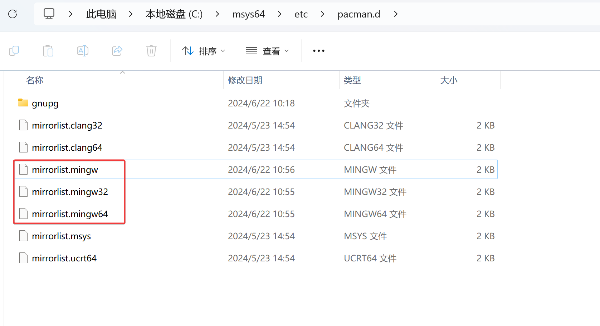
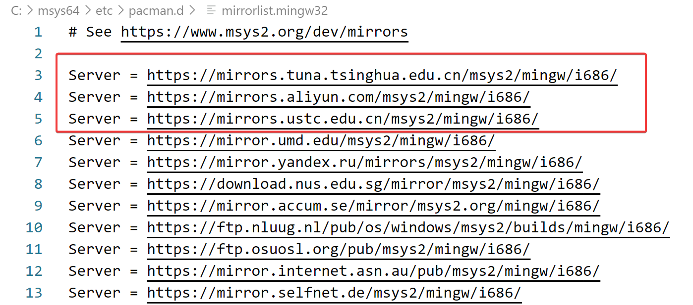
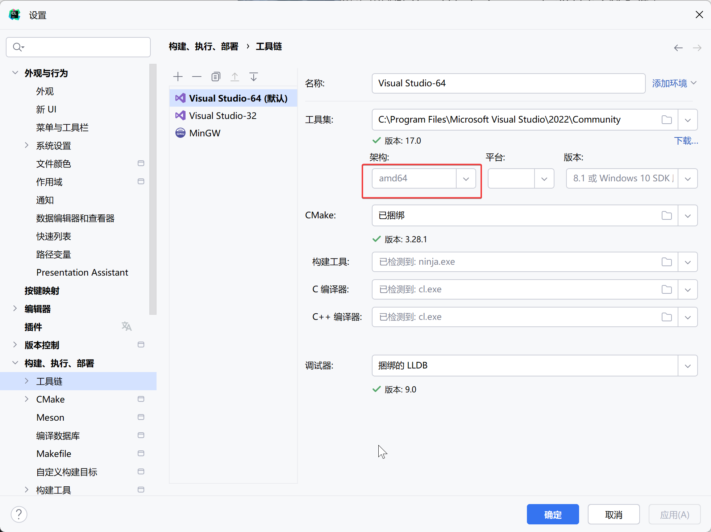
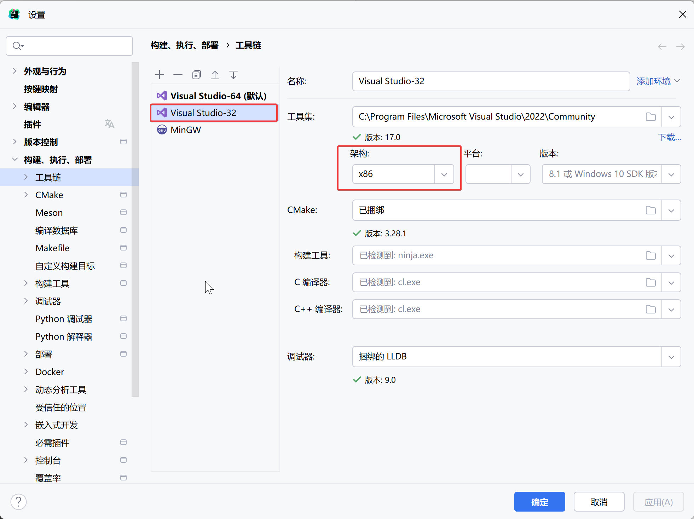
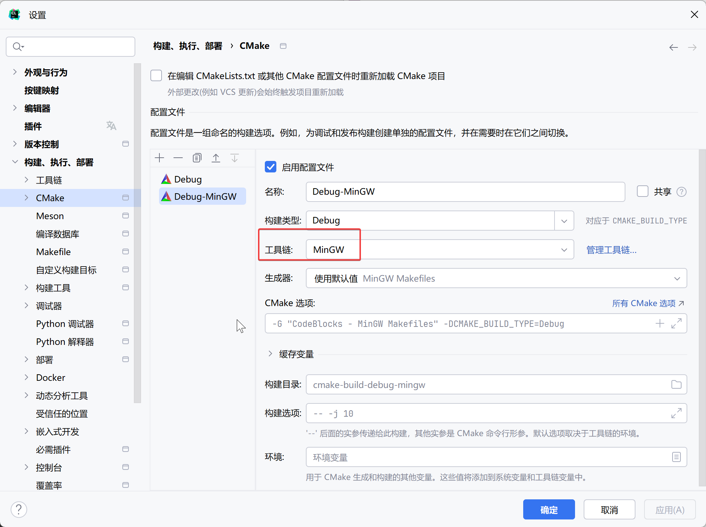
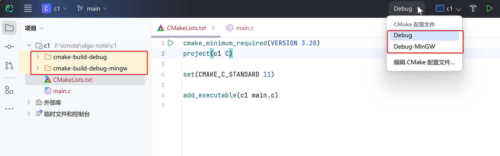

# 准备工作

## 环境配置

### 安装 Visual Studio Community 

1、安装 [Visual Studio Community](https://visualstudio.microsoft.com/zh-hans/vs/community/)

2、安装时，选择 Desktop development with C++ 工作负载

### 安装 MinGW64

1、通过包管理工具 [MSYS2](https://www.msys2.org/docs/installer/) 安装 MinGW。

2、修改 `C:\msys64\etc\pacman.d` 目录下 3 个 mingw 源配置文件，将清华大学、阿里等国内源移动到最前面：




3、启动 C:\msys64\msys2.exe，安装 MinGW64：

```
pacman -Su # 更新软件包
pacman -Sy base-devel # 安装基本开发工具
pacman -S mingw-w64-x86_64-toolchain # 安装 MinGW64 工具链, C:\msys64\mingw64
```

**为什么要安装 MinGW64？**

- Visual Studio Community 2022 默认支持的 C++ 标准版本是 C++20，但对于纯 C 语言来说只支持到 C99 标准（默认使用C++编译器），这意味着如果您需要编译遵循 C11 标准的 C 代码,Visual Studio 将无法满足需求。
- MinGW64 支持 C11 标准，可以用来编译 C 代码

> 可以不安装，Clion 默认支持 MinGW64 工具链。

### 安装 Clion

1、安装 Clion。

2、配置中新增工具链。




3、配置调试 CMake。

将 Visual Studio-64 选择为默认后，CMake 会自动修改默认 Debug 为使用 Visual Studio-64 工具链，

额外新增一个 MinGW64 工具链，用于编译 C 代码：




4、新建 C 项目后，会自动生成 2 个编译目录。



## Debugger


